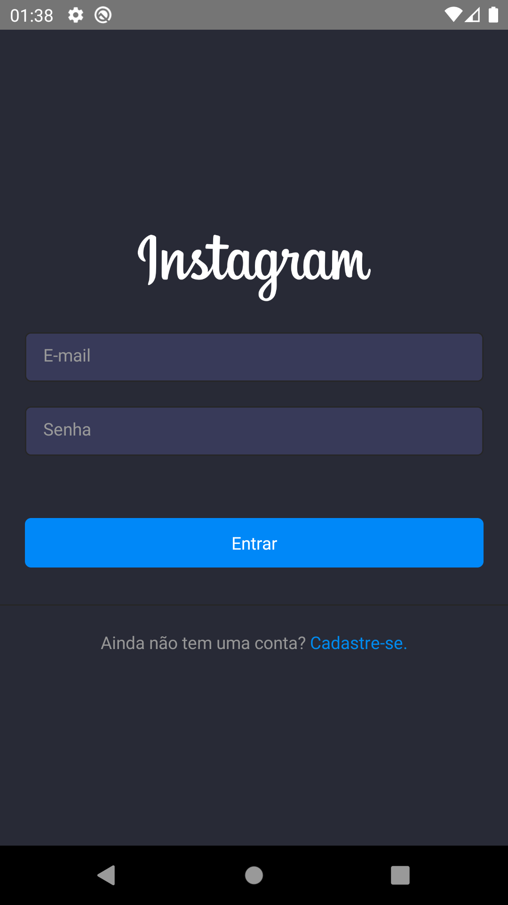
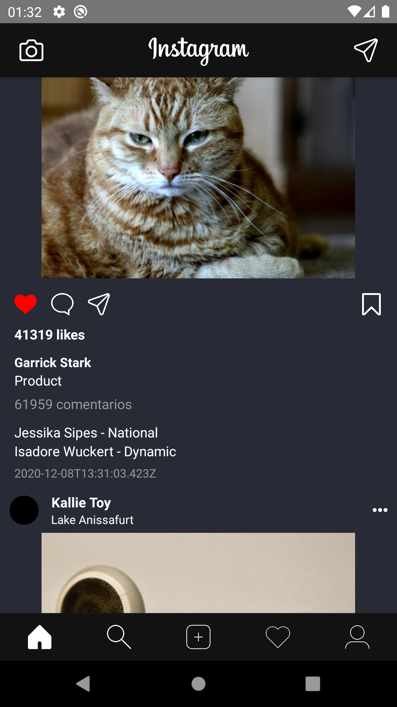
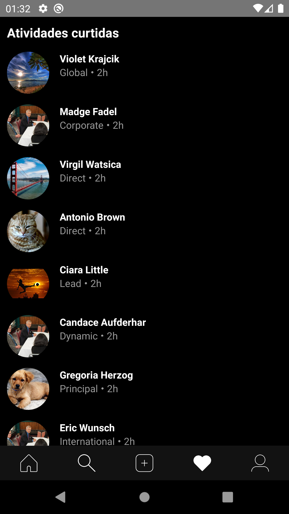
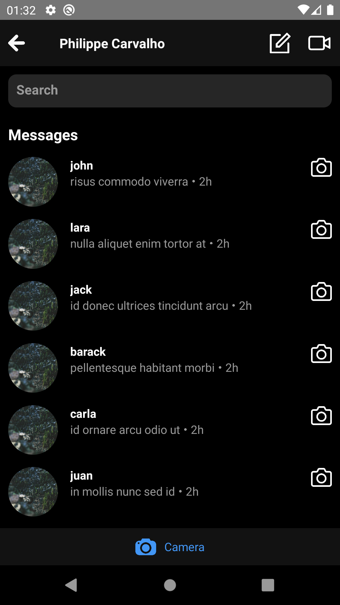
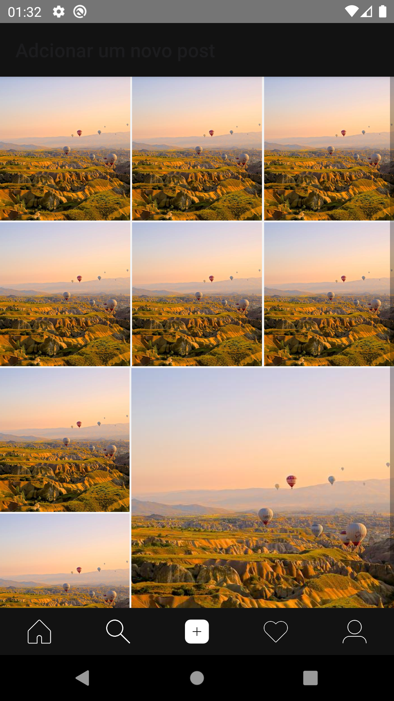
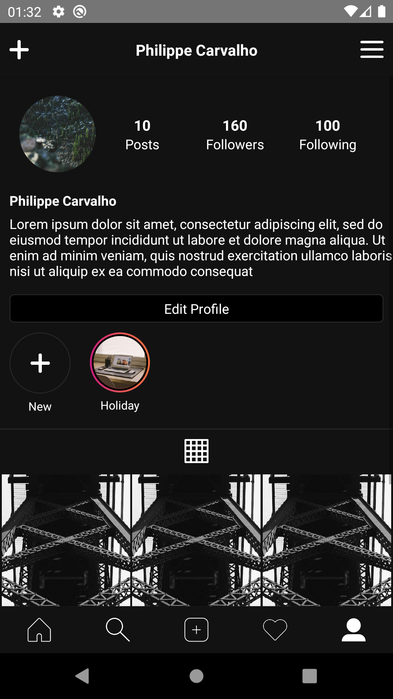

# Desafio 04 - Unifacs - App React Native Instagram Clone

## How to use || Como rodar
- `npm install or`
- `yarn install`
- `react-native run-ios` or `react-native run-android`

## Screens Project

<table>
  <tr>
    <td></td>
    <td></td>
  <tr>
  <tr>
    <td></td>
    <td></td>
  <tr>
  <tr>
    <td></td>
    <td></td>
  <tr>
</table>

## Dependencies
- `@react-native-community/masked-view": "^0.1.10"`
- `@react-navigation/bottom-tabs": "^5.8.0"`
- `@react-navigation/native": "^5.7.3"`
- `@react-navigation/stack": "^5.9.0"`
- `react": "16.13.1"`
- `react-native": "0.63.2"`
- `react-native-camera": "^3.36.0"`
- `react-native-gesture-handler": "^1.7.0"`
- `react-native-linear-gradient": "^2.5.6"`
- `react-native-reanimated": "^1.10.2"`
- `react-native-safe-area-context": "^3.1.3"`
- `react-native-screens": "^2.10.1"`
- `react-native-webview": "^10.6.0"`

## Squad || Equipe
- Philippe Carvalho - 205182018
- Maurício Lanner - 205182016
- Sérgio Deiró de Souza Silva - 205182052

## Login para acesso:
- email: 'philippe@gmail.com',
- password: '123456'